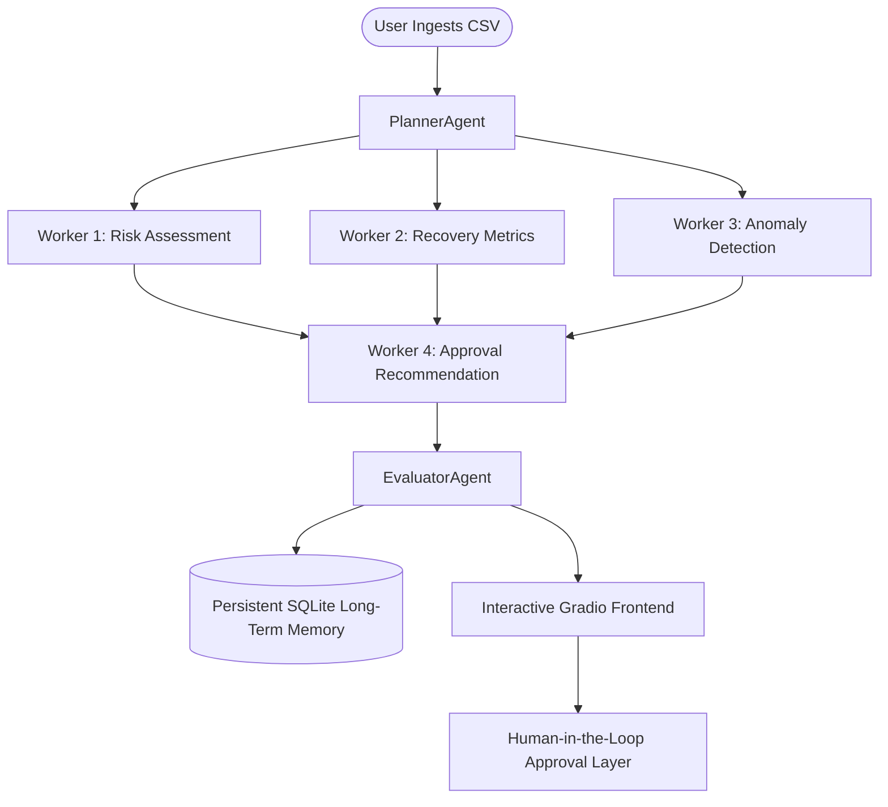

# SHG Guardian AI: Multi-Agent Financial Risk & Recovery Intelligence System

SHG Guardian AI is an enterprise-grade microfinance auditing and risk assessment platform. It leverages a collaborating fleet of specialized AI agents to analyze member ledgers, predict delinquency risks, identify data inconsistencies, and route escalations through a multi-level human-in-the-loop approval workflow.

This project was built as the final portfolio-ready submission for the **Kaggle 5-Day AI Agents: Intensive Vibe Coding Course with Google (June 15 - 19, 2026)** under the **Freestyle Track**.

---

## 🎓 Course Mapping & Architecture Alignment

This system is engineered using the tools, design patterns, and engineering concepts taught during Google's 5-Day Agent Intensive:

*   **Day 1: Introduction to Agents & Vibe Coding (Autonomous Planning)**
    *   *Implementation*: Shifted from single-prompt chat scripts to a decoupled multi-agent planner-worker hierarchy. The `PlannerAgent` ingests data and dynamically constructs structured execution plans for subordinate workers.
*   **Day 2: Agent Tools & Interoperability (A2A Protocol & Tool Integration)**
    *   *Implementation*: Workers execute using specialized tools (`CalculatorTool`, `PredictionTool`, `DatabaseTool`). The agents communicate asynchronously using a structured Agent-to-Agent (`AgentMessage`) messaging protocol.
*   **Day 3: Agent Skills (Memory & Context Optimization)**
    *   *Implementation*: Employs dual-layer memory. Short-term in-memory storage (`SessionMemory`) isolates active analysis runs. Long-term memory is managed via a persistent SQLite database (`DatabaseManager`). A local semantic search assistant parses natural language queries and extracts member records.
*   **Day 4: Security and Evaluation (Auditing & Input Checks)**
    *   *Implementation*: Ensures mathematical and formatting safety. The `AnomalyDetectionAgent` screens records for duplicates, negative values, and unrealistic spikes. The `EvaluatorAgent` acts as a quality audit layer to enforce consensus before compiling reports.
*   **Day 5: Spec-Driven Production-Grade Development (Gradio & Observability)**
    *   *Implementation*: Gradio interface featuring Plotly dashboards, a live observability execution log panel, and a multi-level human approvals queue (simulating Field Officer $\rightarrow$ Regional Coordinator validation). Pushed live to Hugging Face Spaces.

---

## 📐 Architecture Flow



---

## 📂 File Structure

```
.
├── app.py                      # Gradio Web Interface Dashboard
├── main_agent.py               # Orchestrator & CLI Runner
├── requirements.txt            # Package dependencies
├── README.md                   # Project description and course mapping
├── deploy_to_hf.py             # Hugging Face deployment script
├── Project_Guide/              # Capstone guides and writeup assets
│   ├── Write-up.txt            # Ready-to-copy Kaggle Submission text
│   ├── guidebook.md            # Detailed user manual
│   └── kaggle_capstone_brief.md # Kaggle Capstone rules checklist
├── agents/                     # Specialized agent modules
│   ├── planner.py
│   ├── risk_agent.py
│   ├── recovery_agent.py
│   ├── anomaly_agent.py
│   ├── approval_agent.py
│   └── evaluator.py
├── tools/                      # Shared helper tools
│   ├── calculator_tool.py
│   ├── prediction_tool.py
│   └── database_tool.py
├── memory/                     # Session and database persistence
│   ├── database.py
│   └── session_memory.py
└── core/                       # Protocols & logging
    ├── a2a_protocol.py
    └── observability.py
```

---

## 🛠️ Installation & Setup

1.  **Install Python Dependencies**:
    Ensure you have Python 3.8+ installed, then run:
    ```bash
    pip install -r requirements.txt
    ```

2.  **Verify Pipeline with Benchmark Datasets**:
    Run the CLI test suite to verify processing against all 12 edge-case CSV files:
    ```bash
    python main_agent.py --test-all
    ```

3.  **Launch the Web Dashboard Locally**:
    Start the Gradio local server:
    ```bash
    python app.py
    ```
    Open your web browser and navigate to: [http://127.0.0.1:7860](http://127.0.0.1:7860)

---

## 🧪 Verification Scenarios (The 12 Test Cases)

The project validates data inputs against the following edge-case ledger files in `Sample_test_dat/`:
1.  **High Risk Member**: Low savings, high outstanding loan, multiple missed payments.
2.  **Low Risk Member**: High savings, zero missed payments.
3.  **Medium Risk Member**: Minor missed payments.
4.  **Zero Payment**: Validates recovery agent behavior with 0% collection rates.
5.  **Loan Already Cleared**: Safe state validation for members with zero outstanding debt.
6.  **Anomaly: Payment > Due**: Large overpayment anomaly validation.
7.  **Anomaly: Negative Loan**: Triggers input validation warnings (Loan < 0).
8.  **Anomaly: Negative Savings**: Triggers input validation warnings (Savings < 0).
9.  **Division by Zero**: Safeguards computations when monthly due is 0.
10. **Duplicate Member IDs**: Identifies repeated key records in the spreadsheet.
11. **Missing Values**: Identifies blank columns in database inputs.
12. **Mixed Dataset (Master)**: Master validation set combining all elements to test consensus.

---

## 👤 Developer Profile & Credits

Developed by **GowthamDeveloper** as the portfolio capstone submission for the Kaggle & Google AI Agents Intensive (June 2026).
*   **GitHub**: [https://github.com/GowthamCodeBase](https://github.com/GowthamCodeBase)
*   **Hugging Face Spaces Space**: [https://huggingface.co/spaces/GowthamDeveloper/shg-guardian-ai](https://huggingface.co/spaces/GowthamDeveloper/shg-guardian-ai)
