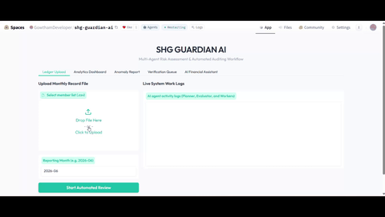

# SHG GUARDIAN AI
### Multi-Agent Risk Assessment & Automated Auditing Workflow

🛡️ **An Enterprise-Grade Microfinance Auditing Platform** built as the final portfolio-ready capstone project for **Kaggle's 5-Day AI Agents: Intensive Vibe Coding Course with Google (June 15 - 19, 2026)** under the **Freestyle Track**.

---

<div align="center">


</div>

<p align="center">
  
</p>
<p align="center">
  <strong>🌐 Try the Live Interactive App: <a href="https://huggingface.co/spaces/GowthamDeveloper/shg-guardian-ai" target="_blank">huggingface.co/spaces/GowthamDeveloper/shg-guardian-ai</a></strong>
</p>
<p align="center">
  <strong> ✍🏻 Kaggle Write-Ups : <a href="https://www.kaggle.com/competitions/vibecoding-agents-capstone-project/writeups/new-writeup-1781946639171" target="_blank">SHG Guardian AI: Multi-Agent Risk Auditing System</a></strong>
</p>
---

## 🎨 Overview & Project Vision

Developed by **GowthamDeveloper**, **SHG Guardian AI** is a multi-agent system designed for rural Self-Help Groups (SHGs) and microfinance institutions. It automates monthly ledger validation, forecasts member default probabilities, detects data warnings, and routes risky cases through a human-in-the-loop audit trail.

Rather than relying on simple scripting wrappers, this system coordinates a specialized fleet of independent AI agents using a standardized messaging protocol. This approach guarantees operational fault tolerance, compliance auditing, and explainable AI insights.

---

## 🎓 Course Mapping & Architectural Alignment

Each day of Google's AI Agent Intensive corresponds to a core component in the SHG Guardian AI platform:

*   **Day 1: Introduction to Agents & Vibe Coding (Autonomous Planning)**
    *   *Implementation*: Decoupled monolithic scripts into a robust `PlannerAgent` that receives ledger inputs and schedules tasks for subordinate workers.
*   **Day 2: Agent Tools & Interoperability (A2A Protocol & Shared Tools)**
    *   *Implementation*: Worker agents utilize custom-built tools (`CalculatorTool`, `PredictionTool`, `DatabaseTool`) and communicate asynchronously using a validated `AgentMessage` protocol.
*   **Day 3: Agent Skills (Memory & Context Optimization)**
    *   *Implementation*: Employs a dual-layer memory layout: temporary session memory (`SessionMemory`) for safe file uploads, and long-term persistent storage (`DatabaseManager` SQLite) to track member risk score trends over multiple months. Includes a local semantic search assistant.
*   **Day 4: Security and Evaluation (Auditing & Input Checks)**
    *   *Implementation*: Implements negative metrics warnings, duplicate key checks, and SQL injection protections. The `EvaluatorAgent` serves as a quality controller, validating all calculations and ensuring agent consensus before writing records.
*   **Day 5: Spec-Driven Production-Grade Development (Gradio & Observability)**
    *   *Implementation*: Runs a responsive Gradio web interface supporting both light and dark modes natively. Pushed live to Hugging Face Spaces with detailed live work logging and programmatic Python API endpoints.

---

## 📐 Architecture Flow


---

## 💻 Programmatic Python API Documentation

You can query the agent programmatically from external scripts. Install the Python Gradio client:

```bash
pip install gradio_client
```

### 1. Ask the AI Financial Assistant (`/chatbot_interface`)
Queries the SQLite database using natural language:

```python
from gradio_client import Client

client = Client("GowthamDeveloper/shg-guardian-ai")
result = client.predict(
    message="Why is member SHG001 flagged?",
    api_name="/chatbot_interface"
)
print(result)
```
*   **Accepts**: `message` (str)
*   **Returns**: `response` (str)

### 2. Process Monthly Ledger (`/process_upload`)
Uploads a ledger file to run the multi-agent pipeline:

```python
from gradio_client import Client, handle_file

client = Client("GowthamDeveloper/shg-guardian-ai")
result = client.predict(
    file=handle_file('path/to/your/ledger.csv'),
    month="2026-06",
    api_name="/process_upload"
)
# Returns: (Status MD, Observability Logs, KPI Cards HTML, Member DataFrame, Warnings DataFrame, Plot 1, Plot 2)
print(result[0]) 
```
*   **Accepts**: `file` (filepath), `month` (str)
*   **Returns**: Tuple of 7 elements.

### 3. Record Audit Decision (`/process_approval_action`)
Submits a Field Officer check or Regional Coordinator decision:

```python
from gradio_client import Client

client = Client("GowthamDeveloper/shg-guardian-ai")
result = client.predict(
    approval_id="SHG008",
    role="Regional Coordinator",
    decision="APPROVED",
    comments="Savings and repayment records updated successfully.",
    api_name="/process_approval_action"
)
print(result[0])
```
*   **Accepts**: `approval_id` (str - supports both row IDs and Member IDs like `SHG008`), `role` (str), `decision` (str), `comments` (str)
*   **Returns**: Tuple of 2 elements (Status MD, updated DataFrame).

### 4. Fetch Active Review Queue (`/get_approvals_dataframe`)
Retrieves all pending escalations in the queue:

```python
from gradio_client import Client

client = Client("GowthamDeveloper/shg-guardian-ai")
result = client.predict(
    api_name="/get_approvals_dataframe"
)
print(result)
```
*   **Accepts**: No parameters.
*   **Returns**: Dataframe dictionary containing all active escalation rows.

---

## 🛠️ Installation & Setup

1.  **Install Python Dependencies**:
    ```bash
    pip install -r requirements.txt
    ```

2.  **Verify Pipeline locally (CLI tests)**:
    ```bash
    python main_agent.py --test-all
    ```

3.  **Launch Web Dashboard locally**:
    ```bash
    python app.py
    ```
    Navigate to [http://127.0.0.1:7860](http://127.0.0.1:7860).

---

## 📊 Verification Scenarios (The 12 Benchmark CSVs)

The project validates data inputs against the following edge-case ledger files in `Sample_test_dat/`:
1.  **High Risk Member**: Low savings, high outstanding loan, multiple missed payments.
2.  **Low Risk Member**: High savings, zero missed payments.
3.  **Medium Risk Member**: Minor missed payments.
4.  **Zero Payment**: Validates recovery agent behavior with 0% collection rates.
5.  **Loan Already Cleared**: Safe state validation for members with zero outstanding debt.
6.  **Anomaly: Payment > Due**: Large overpayment anomaly validation.
7.  **Anomaly: Negative Loan**: Triggers input validation warnings (Loan < 0).
8.  **Anomaly: Negative Savings**: Triggers input validation warnings (Savings < 0).
9.  **Division by Zero**: Safeguards computations when monthly due is 0.
10. **Duplicate Member IDs**: Identifies repeated key records in the spreadsheet.
11. **Missing Values**: Identifies blank columns in database inputs.
12. **Mixed Dataset (Master)**: Master validation set combining all elements to test consensus.

---

## 🌟 Why This Project Merits Evaluation

*   **Engineering Rigor**: Leverages a robust multi-agent paradigm instead of a simple single-prompt wrapper, ensuring clean error separation.
*   **Human-in-the-Loop Governance**: Features a structured approval queue that respects organizational workflows.
*   **Persistent & Session Memory**: Combines SQLite and local caches for historical analysis and trend prediction.
*   **Complete Portability**: Includes programmatic APIs (`gradio_client`) and CLI test scripts, demonstrating enterprise integration readiness.
*   **Adaptive Frontend**: Responsive, clean CSS handles both light and dark mode themes natively.

Developed with 💻 by **GowthamDeveloper** (June 2026).
*   **GitHub**: [https://github.com/GowthamCodeBase](https://github.com/GowthamCodeBase)
*   **Hugging Face Spaces Space**: [https://huggingface.co/spaces/GowthamDeveloper/shg-guardian-ai](https://huggingface.co/spaces/GowthamDeveloper/shg-guardian-ai)
*   **Kaggle Write-Ups**: [https://www.kaggle.com/competitions/vibecoding-agents-capstone-project/writeups/new-writeup-1781946639171](https://www.kaggle.com/competitions/vibecoding-agents-capstone-project/writeups/new-writeup-1781946639171)
